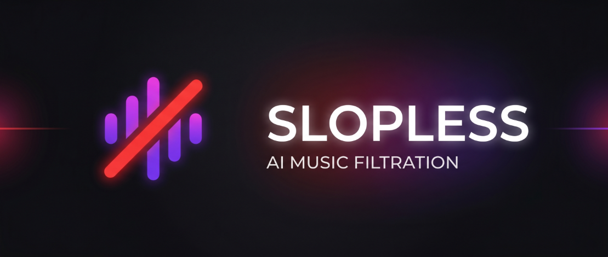
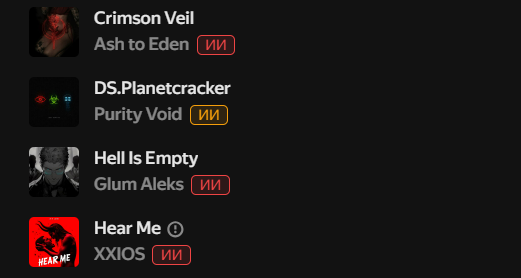
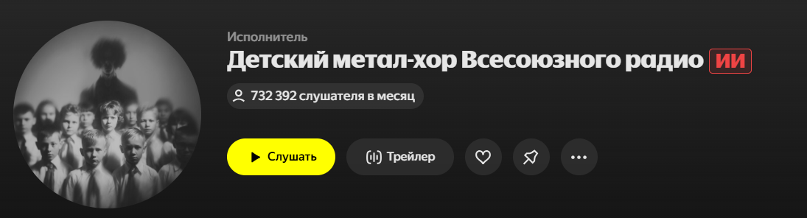
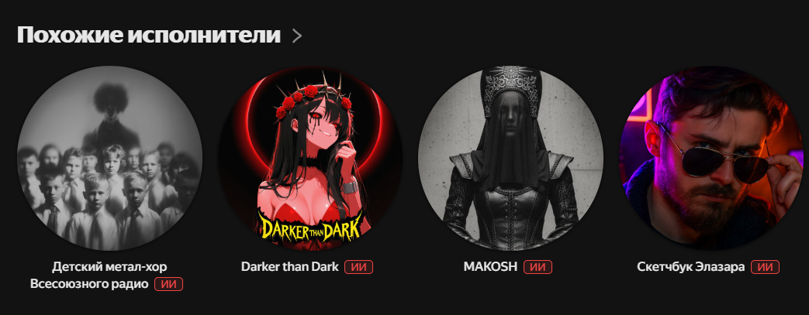

# Slopless for PulseSync

   

> **Примечание:** Это неофициальный нативный порт браузерного расширения [Slopless](https://github.com/alexeyfv/slopless) (оригинальный автор: [@alexeyfv](https://github.com/alexeyfv)), адаптированный специально для работы внутри десктопного клиента Яндекс Музыки — **PulseSync**.

## О проекте

Медиатека Яндекса всё чаще пополняется музыкой, полностью сгенерированной нейросетями. Этот аддон позволяет очистить ваш музыкальный поток от такого контента. Скрипт помечает ИИ-артистов специальными бейджами и умеет автоматически пропускать или ставить дизлайк сгенерированным трекам.

---

## Ручная установка

1. Убедитесь, что у вас установлен десктопный клиент [PulseSync](https://github.com/PulseSync-LLC/PulseSync-client).
2. Скачайте последнюю версию аддона из раздела [Releases](../../releases).
3. Распакуйте архив и поместите папку `slopless` в директорию аддонов PulseSync:
   * **Windows:** `%APPDATA%/PulseSync/addons/`
   * **Linux/macOS:** `~/.config/PulseSync/addons/`
4. Перезапустите клиент и включите аддон в настройках.

---

## Настройки

После установки в настройках PulseSync появится раздел **Slopless**, где можно детально настроить поведение аддона.

| Параметр | Описание | Доступные значения |
| :--- | :--- | :--- |
| **Режим** | Что делать, если заиграл ИИ-трек? | `Дизлайк и пропуск`, `Дизлайк (если нет лайка)`, `Просто пропуск`, `Пропустить (если нет лайка)`, `Ничего не делать`, `Лайк` |
| **Чувствительность** | Насколько строго фильтровать треки? | `Все базы` (Slopless + Deezer), `Только Deezer`, `Строгий Deezer (100% ИИ)` |
| **Язык** | Язык бейджей и подсказок | `Русский`, `English` |

---

## Скриншоты интерфейса

  **1. Бейджи ИИ-артистов в списках:**
  

  **2. Маркировка на странице профиля артиста:**
  
  

---

## Благодарности

Вся база данных и изначальная идея принадлежат автору оригинального проекта:
* [Slopless by alexeyfv](https://github.com/alexeyfv/slopless)

---

## Лицензия

Этот проект распространяется под лицензией MIT. Подробности см. в файле [LICENSE](LICENSE). База данных подтягивается напрямую из репозитория оригинального проекта.