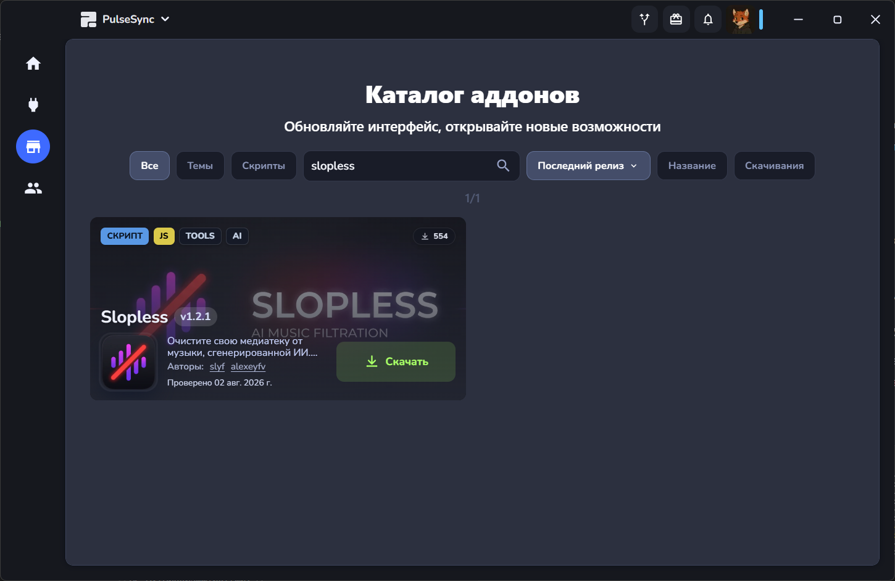

# Slopless for PulseSync

   

> **Примечание:** Это неофициальный нативный порт браузерного расширения [Slopless](https://github.com/alexeyfv/slopless) (оригинальный автор: [@alexeyfv](https://github.com/alexeyfv)), адаптированный специально для работы внутри десктопного клиента Яндекс Музыки — **PulseSync**.

## О проекте

Медиатека Яндекса всё чаще пополняется музыкой, полностью сгенерированной нейросетями. Этот аддон позволяет очистить ваш музыкальный поток от такого контента. Скрипт помечает ИИ-артистов и отдельные ИИ-треки специальными бейджами, а также умеет автоматически пропускать или ставить дизлайк сгенерированным релизам. Работает через API оригинального проекта.

---

## Установка

Для работы аддона убедитесь, что у вас установлен десктопный клиент [PulseSync](https://github.com/PulseSync-LLC/PulseSync-client). Выберите один из удобных способов установки:

### Способ 1: Из встроенного каталога (Рекомендуется)
Самый простой и надежный способ. Плагин будет автоматически обновляться при выходе новых версий.
1. В PulseSync перейдите во вкладку с каталогом расширений.
2. Найдите **Slopless** в списке и нажмите кнопку установки.

    

3. В разделе установленных аддонов включите его.

### Способ 2: Установка из пакета (.pext)
1. Скачайте свежий файл `slopless-vX.X.X.pext` из раздела [Releases](../../releases/latest).
2. Откройте скачанный файл с помощью PulseSync или просто перетащите его в окно приложения.
3. В разделе установленных аддонов включите его.

### Способ 3: Ручная установка из архива (.zip)
1. Скачайте архив аддона (`slopless-vX.X.X.zip`) из раздела [Releases](../../releases/latest).
2. Распакуйте архив в новую папку `slopless` в директорию аддонов PulseSync:
   * **Windows:** `%APPDATA%/PulseSync/addons/`
   * **Linux/macOS:** `~/.config/PulseSync/addons/`
3. В разделе установленных аддонов выберите "Перезагрузить аддоны" и включите нужный.

---

## Настройки

| Параметр | Описание |
| :--- | :--- |
| **Действие при воспроизведении** | Что делать, если заиграл ИИ-трек: дизлайк, пропуск, ничего не делать или лайк. |
| **Проверять отдельные треки** | Искать сгенерированные треки даже у «чистых» артистов. |
| **Порог «ИИ-шности» артиста** | Какой процент треков артиста должен быть от ИИ, чтобы считать его нейро-артистом (рекомендуется 10%). |
| **Помечать ИИ-артистов / треки** | Включение и отключение визуальных красных меток в интерфейсе Яндекса. |
| **Язык** | Язык бейджей и всплывающих подсказок (Русский / English). |

---

## Скриншоты интерфейса

  **1. Бейджи ИИ-артистов в списках:**
  
  

  **2. Маркировка на странице профиля артиста:**
  
  
  

---

## Благодарности

Серверное API и изначальная идея принадлежат автору оригинального проекта:
* [Slopless by alexeyfv](https://github.com/alexeyfv/slopless)

---

## Лицензия

Этот проект распространяется под лицензией GNU GPLv3. Подробности см. в файле [LICENSE](LICENSE). Данные для анализа запрашиваются напрямую с серверов оригинального проекта.